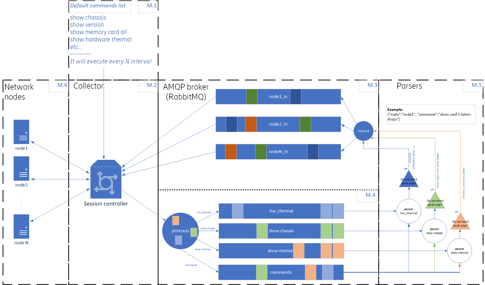

# SSH Collector

SSH Collector is a golang app used for taking data from the network nodes over SSH protocol.
You can use it with AMQP message broker like RabbitMQ.

[SSH Picker в ежедневной работе сетевого инженера](https://habr.com/ru/post/647143/)

Collector can work with message broker and with two-way of commands.
If parser wants to get more data it can easly send necessary command to collector via inbout exchange point and receive data from command queue.
Detail view in the schema below


## Latest changes

19/11/2022
Added two additional key exchange algorithms: curve25519-sha256, diffie-hellman-group14-sha256
Node profile has additional settings for enable and non-enable mode. Now user can point exact command for entering end exit from enable mode
Added one more example for two-way commands from parsers


## Installation

Clone the repository to your PC

```bash
cd collector
chmod +x build.sh
./build.sh
```

## Usage
Make necessary changes in the config.tml file.

```bash
./collector_2.3 ./config.tml
```

## Contributing
Pull requests are welcome. For major changes, please open an issue first to discuss what you would like to change.

Please make sure to update tests as appropriate.

## License
[MIT](https://choosealicense.com/licenses/mit/)
